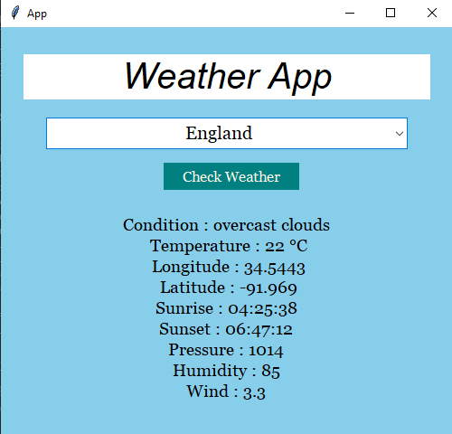

# 🌦️ Weather App

A simple weather application that displays real-time weather information for any city in the world. This app fetches data from the OpenWeatherMap API and shows details like temperature, weather condition, humidity, and wind speed.

---

## 📸 Demo

---

## 🧰 Tech Stack

- **Frontend**: Python
- **GUI Library**: Tkinter
- **API**: [OpenWeatherMap API](https://openweathermap.org/api)
- **Other Libraries**: `requests`, `time`

---

## 🚀 Features

- 🌍 Search weather by city name
- 🌡️ Real-time temperature and weather conditions
- 💧 Humidity, wind speed, and more
